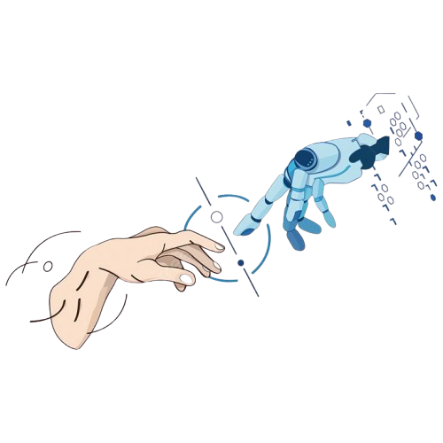

  

<h1 align="center" style="font-size: 48px; font-weight: bold; letter-spacing: 2px;">
  <code>DataCrafter 20</code>
</h1>

<h1 align="center">Hi, I'm Ndivhuwo Munyai 👋</h1>
<h3 align="center">AI Data Annotator | BSc Computer Science & Information Systems |</h3>
<h3 align="center">| Aspiring Data, AI & ML Professional |</h3>

<h1 align="center" style="font-size: 48px; font-weight: bold; letter-spacing: 2px;">
  <code>DataCrafter 20</code>
</h1>

<h1 align="center">Hi, I'm Ndivhuwo Munyai 👋</h1>
<h3 align="center">AI Data Annotator | BSc Computer Science & Information Systems |</h3>
<h3 align="center">| Aspiring Data, AI & ML Professional |</h3>

---

### 🧠 About Me
- 🎓 Aspiring Data, AI & ML Professional
- 🧰 Strong foundation in Python, Java, SQL, AI/ML and data visualization  
- 🌱 Currently building & Solving Data related problems, exploring **AI-powered tools** and doing hands-on projects  
- 💡 I believe in **learning by doing**

📊 Passionate about:  
- &nbsp;&nbsp;&nbsp;&nbsp;📈 Data Science & Analysis  
- &nbsp;&nbsp;&nbsp;&nbsp;🤖 Machine Learning  
- &nbsp;&nbsp;&nbsp;&nbsp;🧠 AI 
- &nbsp;&nbsp;&nbsp;&nbsp;💻 Software   

📫 You can find me on: 

  
  
  

---

### 🔧 Tech Stack

---

### 🧠 Projects

- **🧮 Mathematical Game**
  - Python
  - [Interactive arithmetic game that generates random math problems to improve numerical reasoning, logic, and problem-solving skills.]

- **🎯 COVID-19 Data Analysis & Dashboard**
  - Pandas + Matplotlib + Streamlit
  - [Cleaned, analyzed, and visualized large-scale COVID-19 datasets with exploratory data analysis and an interactive dashboard for trend interpretation.]

- **🔐 Hidden Message Decoder**
  - Python, Unicode Parsing
  - [Automates decoding of hidden visual messages embedded in structured Unicode grids, eliminating manual inspection and reducing errors.]

- **🗄️ MongoDB Student Records Terminal App**
  - Python, MongoDB, Faker
  - [Terminal-based application for managing university student records with full CRUD operations, advanced queries, array updates, and data aggregation.]

- **🤖 AURA – Emotion-Aware AI Assistant**
  - Python, PyTorch, Hugging Face, NLP, Streamlit
  - [Emotion-aware AI system that detects emotional states from text using a fine-tuned Transformer model and generates empathetic, real-time responses.]

---

### 💼 Certifications
| Certificate | Platform |
|------------|----------|
| [Data Analysis with Python](https://courses.cognitiveclass.ai/certificates/f798801fd3ad4056aaf5edd22b2a430d) | IBM / Cognitive Class |
| [Python 101 for Data Science](https://courses.cognitiveclass.ai/certificates/95cdd594e740449abaed4e931bb3c735) | IBM / Cognitive Class |
| Data Science & AI Bootcamp | Datamites |
| Lean Six Sigma White Belt | MF Treinamentos |

---

---

### 📊 GitHub Stats
 
 

---

### 🌱 Fun Facts

- ⚽ Loves football for strategy and discipline  
- 💬 Always down to talk about data, innovation or emerging tech!  

---

### 🤝 Let’s Connect

  
  
  

---

> *“Success is not a matter of luck, but a result of consistent work and resilience.”*

---

_Thank you for visiting my profile! Keep learning, keep building 🌟_

---

